# HDR Gallery Examples

This gallery is generated using [mdouchement/hdr](https://github.com/mdouchement/hdr) Golang's package.

HDR Image credits:
- **forest_path.hdr** © Rafał Mantiuk
- **memorial_o876.hdr** © 1997 by P. Debevec, J. Malik

## Gallery

- Linear ‒ forest_path.hdr

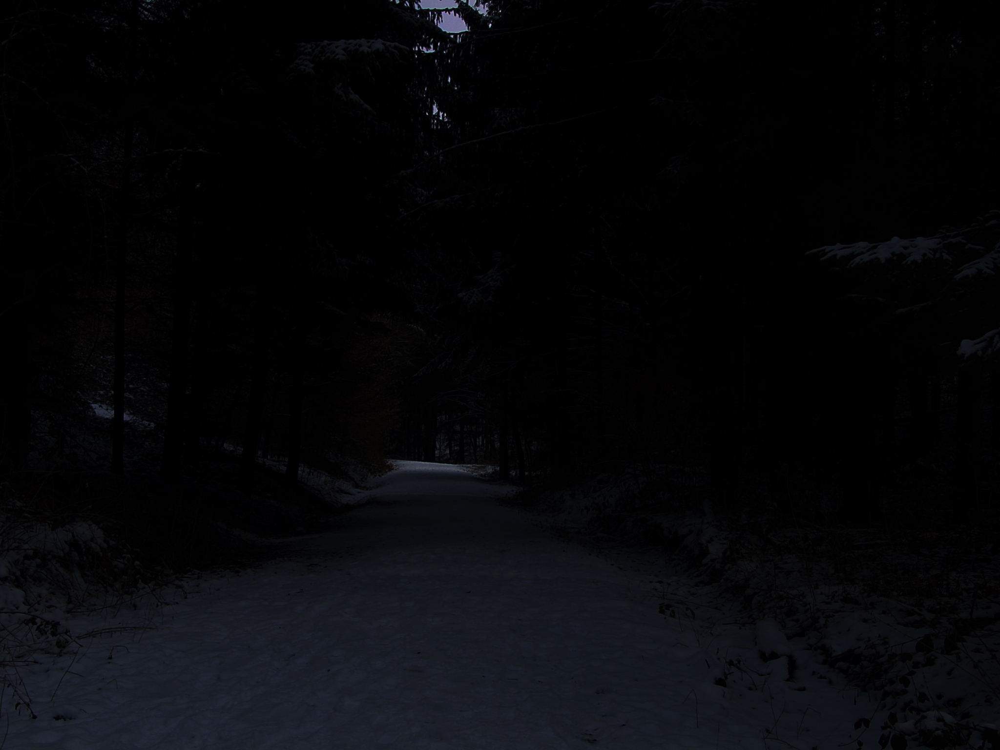

- Logarithmic ‒ forest_path.hdr

- Drago &#39;03 (default) ‒ forest_path.hdr

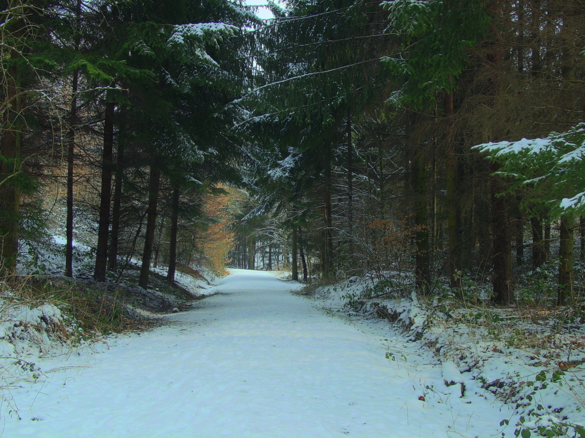

- Durand (default) ‒ forest_path.hdr

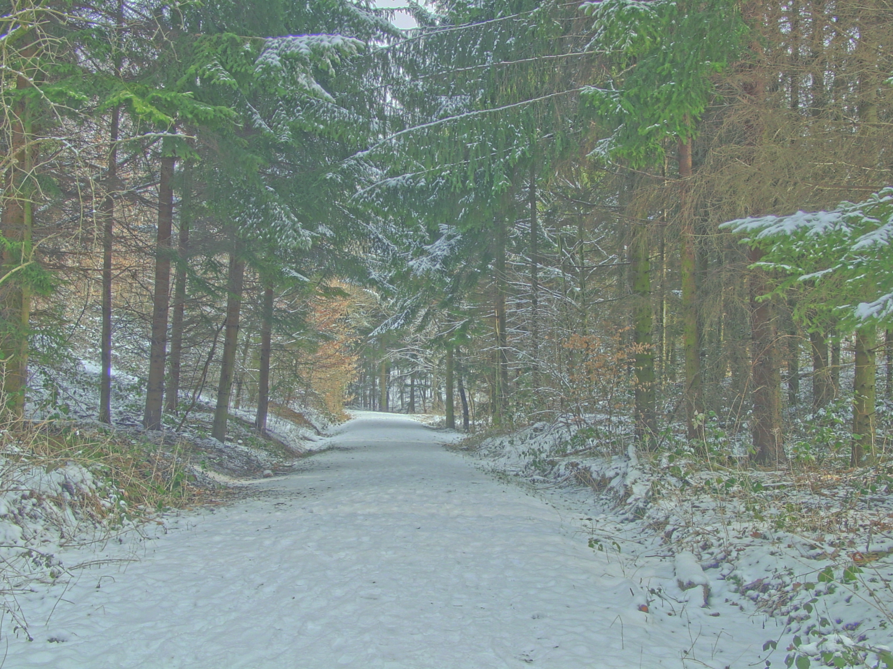

- Reinhard &#39;05 (default) ‒ forest_path.hdr

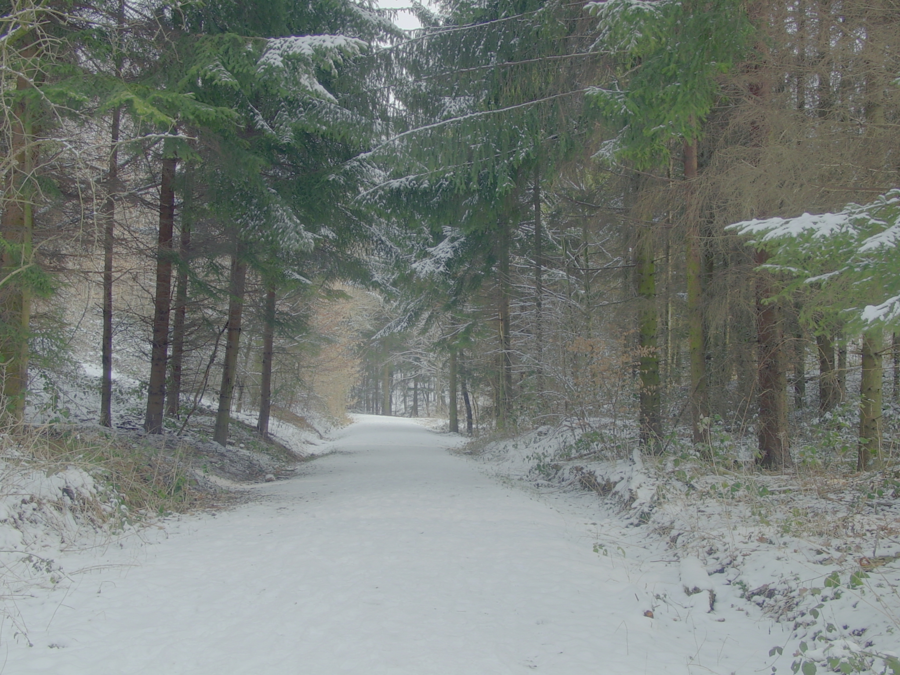

- Custom Reinhard &#39;05 (default) ‒ forest_path.hdr

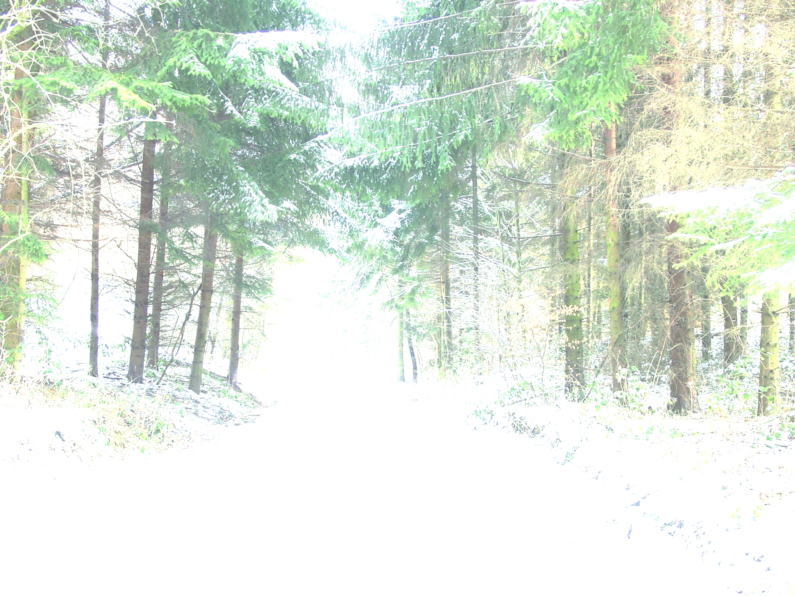

- iCAM06 (default) ‒ forest_path.hdr

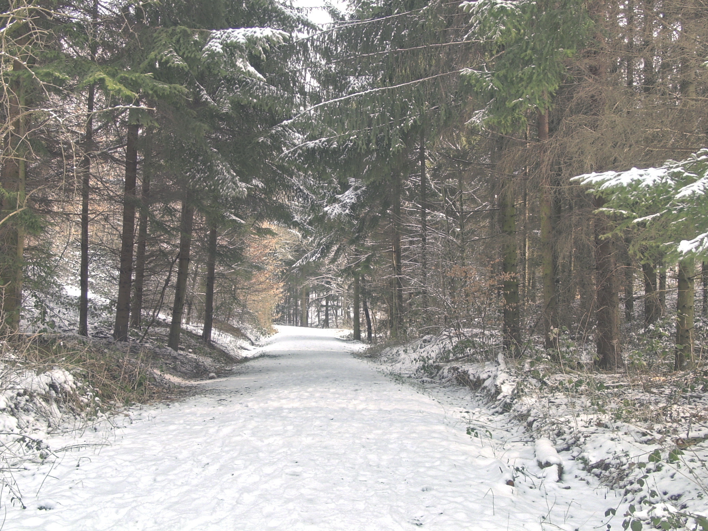

- Linear ‒ memorial_o876.hdr

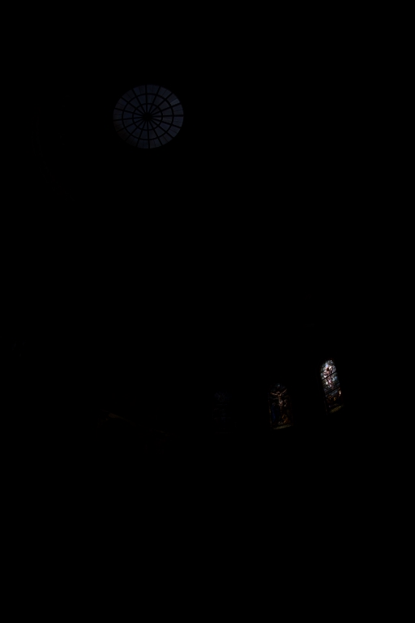

- Logarithmic ‒ memorial_o876.hdr

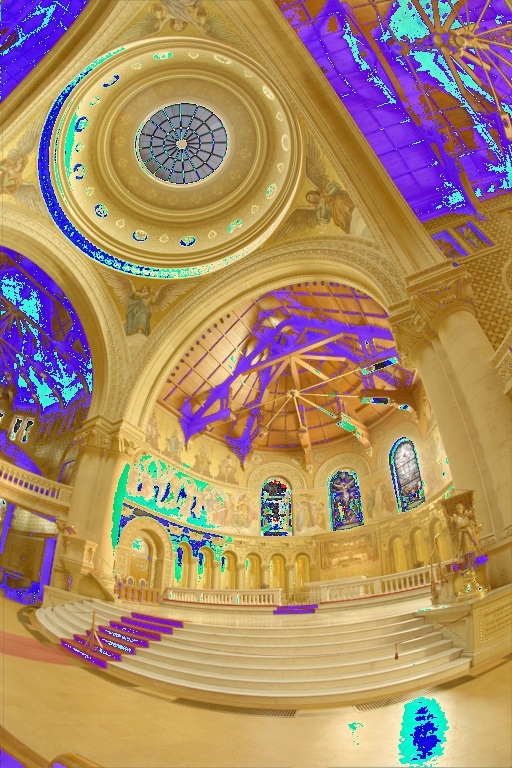

- Drago &#39;03 (default) ‒ memorial_o876.hdr

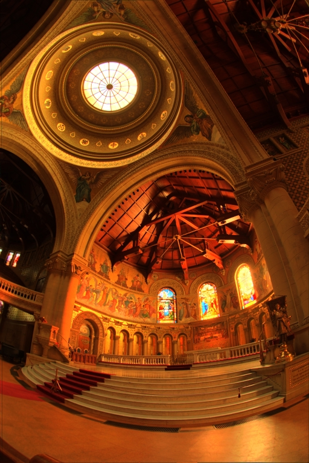

- Durand (default) ‒ memorial_o876.hdr

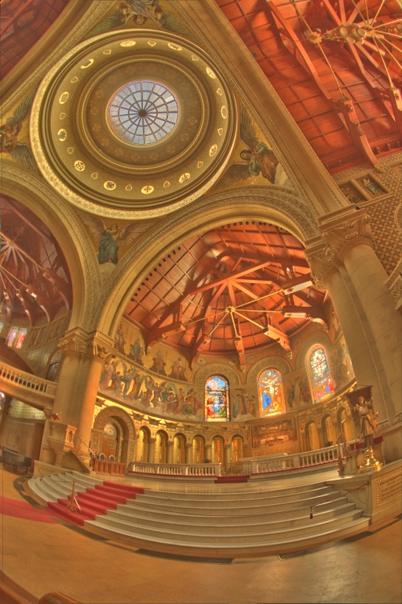

- Reinhard &#39;05 (default) ‒ memorial_o876.hdr

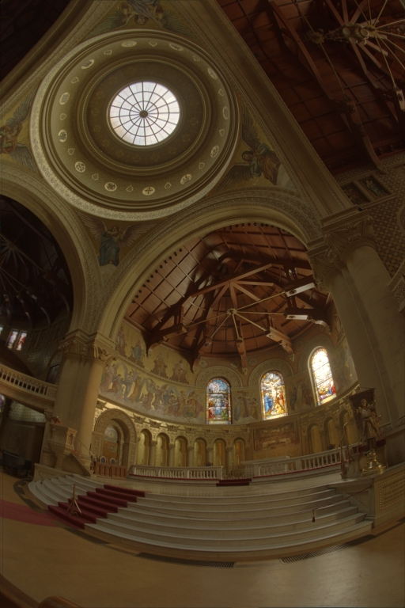

- Custom Reinhard &#39;05 (default) ‒ memorial_o876.hdr

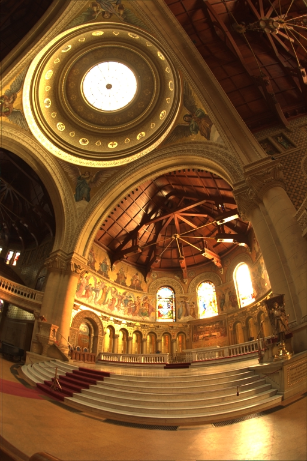

- iCAM06 (default) ‒ memorial_o876.hdr

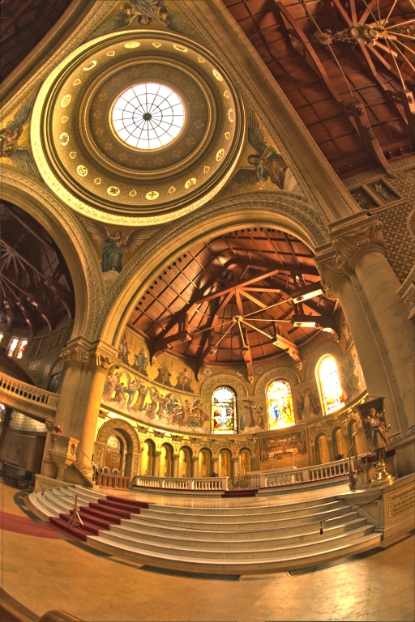

## License

**MIT**
